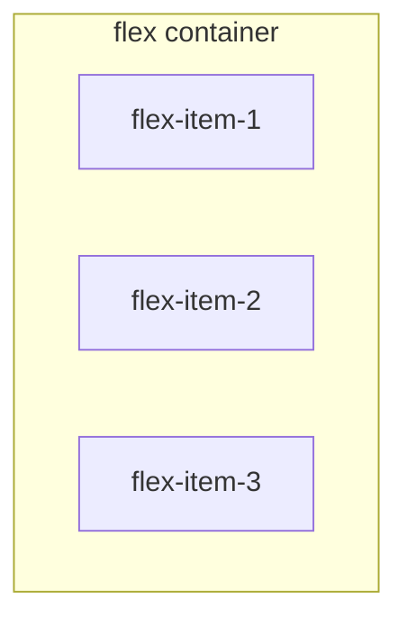

# **how to use flex css**

## Enable Flex
- Use the following css to enable flex on a container
- ---

when enabling flex, `float`, `clear` and `vertical-align` contributes will be disabled in child components.

```css
/* using flex for all children */
.box{
  display: flex;
}

/* using flex for inline objects */
.box{
  display: inline-flex;
}

/* For cross-website display */
.box{
  display: -webkit-flex; /* Safari */
  display: flex;
}
```

## The concepts of flex container 
---

A element that uses flex is called a `flex container`.

Once a element is declared to use flex, all its child elements will automatcally become the container memeber, naming as `flex item`.



## Attributes that can be used on _**flex containers**_

---

```
- flex-direction
- flex-wrap
- flex-flow
- justify-content
- align-items
- align-content
```

### flex-direction

`flex-firection` determines the direction of the main axis (how child elements aligns)

```css
.box {
  flex-direciton: row | row-reverse | column | column-reverse
}
```

- row (default): horizontal align, starting from left
- row-reverse: horizontal align, starting from right
- column: vertical align, starting from top
- column-reverse: vertical align, starting from bottom

### flex-wrap

`flex-wrap` determines how elements align when elements are not fitting in one line.

```css
.box{
  flex-wrap: nowrap | wrap | wrap-reverse;
}
```

- nowrap(default): not changing lines, elements shrinks in the same line.
- wrap: elements will appear at a new line after the first line.
- wrap-reverse: elements will appear at a new line above the first line.

### flew-flow

the combination between `flew-direction` and `flex-wrap`

```css
.box {
  flex-flow: <flex-direction> || <flex-wrap>;
}
```

### <a name="justify-content"> </a> justify-content 

`justify-content` determines how elements align inside one line.

```css
.box {
  justify-content: flex-start | flex-end | center | space-between | space-around;
}
```

- flex-start: left align
- flex-end: right align
- center: middle align
- space-between: align on both side, where spaces between each elements are the same.
- space-around: align on both side, where sapces between two side for each element are the same. This will result in elements align with some space between each end of the line, while double spaces are taken between elements.


### <a name="align-items"> </a> align-items

`align-items` determines how elements align vertically

```css
.box {
  align-items: flex-start | flex-end | center | baseline | stretch;
}
```

- flex-start: every element align at the top of the container
- flex-end: every element align at the end of the contianer
- center: vertical center align
- baseline: first line of words on each element align at the same line.

-stretch: elements inside container with this attibutes will strech to fill the enitre container if their `height` attributes are not specified or setted as `auto`

### align-content

`align-content` defines alignment for multi-line container. if a container only has one line of elements, this will not be working.

```css
.box {
  align-content: flex-start | flex-end | center | space-between | space-around | stretch;
}
```

`flex-start` | `flex-end` | `center` | `space-between` | `space-around` produce the same effect as [justify-content](#a-name%22justify-content%22-a-justify-content)

`stretch` produce the same effect as stretch in [align-items](#a-name%22align-items%22-a-align-items)

